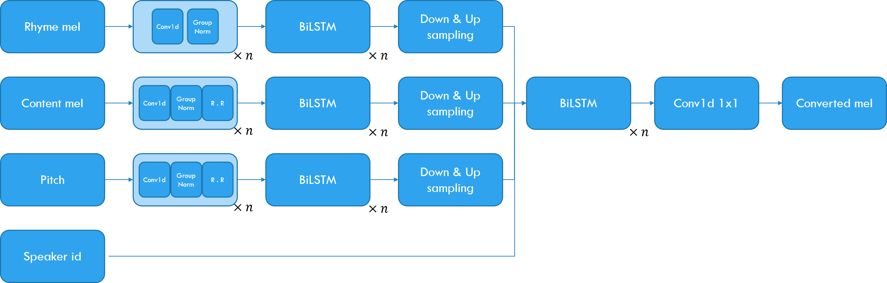

# SPEECHSPLIT

* This code is an implementation of SPEECHSPLIT. The algorithm is based on the following paper:

[Qian, K., Zhang, Y., Chang, S., Cox, D., & Hasegawa-Johnson, M. (2020). Unsupervised speech decomposition via triple information bottleneck. arXiv preprint arXiv:2004.11284.](https://arxiv.org/abs/2004.11284)

# Requirements

* torch >= 1.5.0
* tensorboardX >= 2.0
* librosa >= 0.7.2
* matplotlib >= 3.1.3

* Optional for loss flow
    * tensorboard >= 2.2.2

# Structure


# Used dataset

* Currently uploaded code is for the replication of papaer result.
* I used 106 speakers in VCTK for model training.
* Two speaker is used for inference only.
* I will add the compatible dataset later.

| Dataset   | Dataset address                                 |
|-----------|-------------------------------------------------|
| VCTK      | https://datashare.is.ed.ac.uk/handle/10283/2651 |


# Hyper parameters
Before proceeding, please set the pattern, inference, and checkpoint paths in 'Hyper_Parameter.yaml' according to your environment.

* Sound
    * Setting basic sound parameters.

* Num_Speakers
    * Setting how many speaekers are used.    

* Encoder
    * Setting rhyme, content and pitch encoder parameters
    * Random_Resample set the content and pitch encoder's random resample parameters.

* Decoder
    * Setting the parameters of decoder.

* WaveNet
    * Setting the parameters of Vocoder.
    * This implementation uses a pre-trained Parallel WaveGAN model.
        * https://github.com/CODEJIN/PWGAN_Torch
    * If checkpoint path is `null`, model does not exports wav files.
    * If checkpoint path is not `null`, all parameters must be matched to pre-trained Parallel WaveGAN model.

* Train
    * Setting the parameters of training.
    * When the number of speaekrs in your train dataset is small, I recommend to increase the `Train_Pattern/Accumulated_Dataset_Epoch`.
        * The performance of dataset module of PyTorch is not good when dataset size is small.

* Inference_Path
    * Setting the inference path

* Checkpoint_Path
    * Setting the checkpoint path

* Log_Path
    * Setting the tensorboard log path

* Use_Mixed_Precision
    * Setting mixed precision.
    * To use, `Nvidia apex` must be installed in the environment.

* Device
    * Setting which GPU device is used in multi-GPU enviornment.
    * Or, if using only CPU, please set '-1'.


# Generate pattern

## Command
```
python Pattern_Generate_Replication.py [parameters]
```

## Parameters

* -p <path>
    * Set the path of VCTK. VCTK's patterns are generated.
* -s <path>
    * Set the number of speakers.
* -e <path>
    * Set the evaluation rate in the patterns.
    * For example, when the parameter is `0.1`, 10% data does not trained, and they will used at the evaluation.
* -mw
    * The number of threads used to create the pattern

# Run

## Command
```
python Train.py -s <int>
```

* `-s <int>`
    * The resume step parameter.
    * Default is 0.
    * When this parameter is 0, model try to find the latest checkpoint in checkpoint path.

# Result

* Please refer the demo site:
    * https://codejin.github.io/SpeechSplit_Demo

# Trained checkpoint

| Dataset   | Tag                     | Link      |
|-----------|-------------------------|-----------|
| VCTK      | 106 speaker 800000 Step | [Download](https://drive.google.com/u/0/uc?id=1rrCZfk8b_t0Z1YBGAl4J64HnFJjDZDOM&export=download) |


# Future works

1. Changing one-hot speaker embedding to GE2E speaker embedding.
2. Increasing training dataset (e.g. LibriSpeech) by using GE2E speaker embedding.